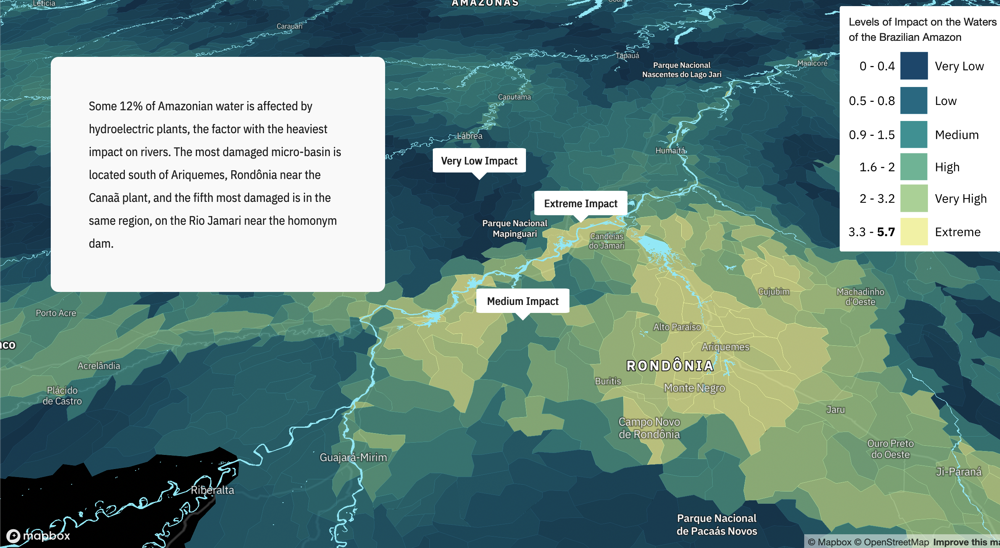
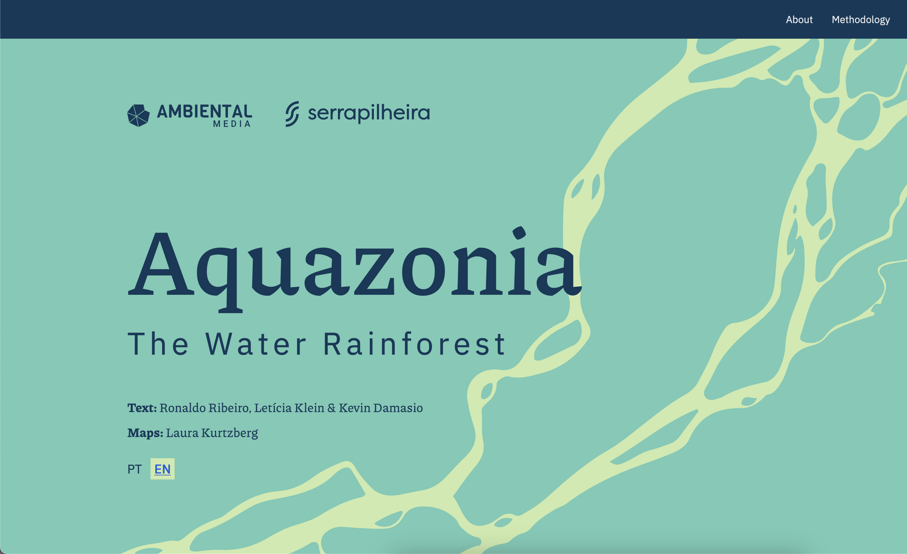
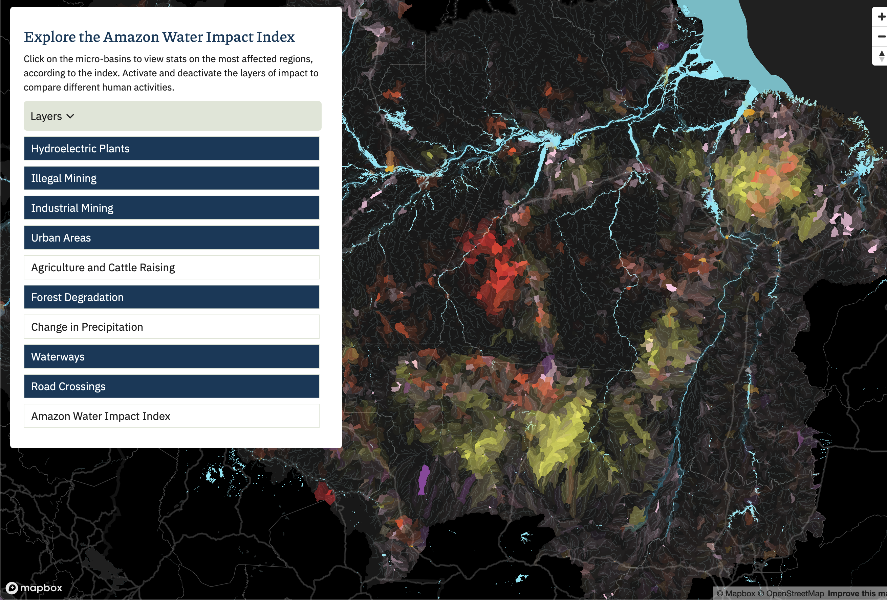

While deforestation and fire have been the main symbols of destruction in the Amazon Rainforest, little is known about the accumulated effects of human activities on the forest’s rivers, lakes and floodplains.

Winner of the WAN-IFRA prize for best data visualization in Latin America for 2022, this series of maps for the Aquazonia story reveal the environmental impact on the freshwater systems of the Amazon Rainforest.

I worked with a team to research and put together the unprecedented Amazon Water Impact Index, draws together monitoring and scientific data to identify the most vulnerable areas of the rainforest's waters.

Using QGIS and Google Earth Engine to analyze both vector and raster geospatial data, and Mapbox.GL to map it for the story, I created the maps and the website platform for Aquazonia.

