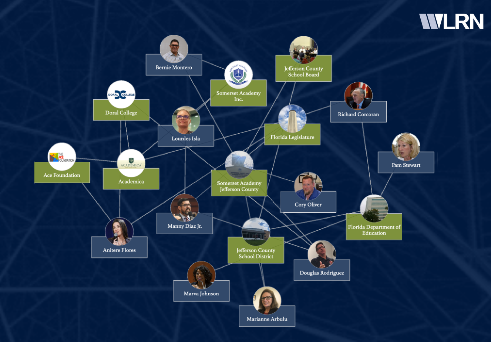

Made in partnership with WLRN, the local radio station in Miami, FL, this network diagram plotted the connections between various charter schools, school boards, and local politicians to uncover the story behind Florida's first all-charter school district in rural Jefferson County.

