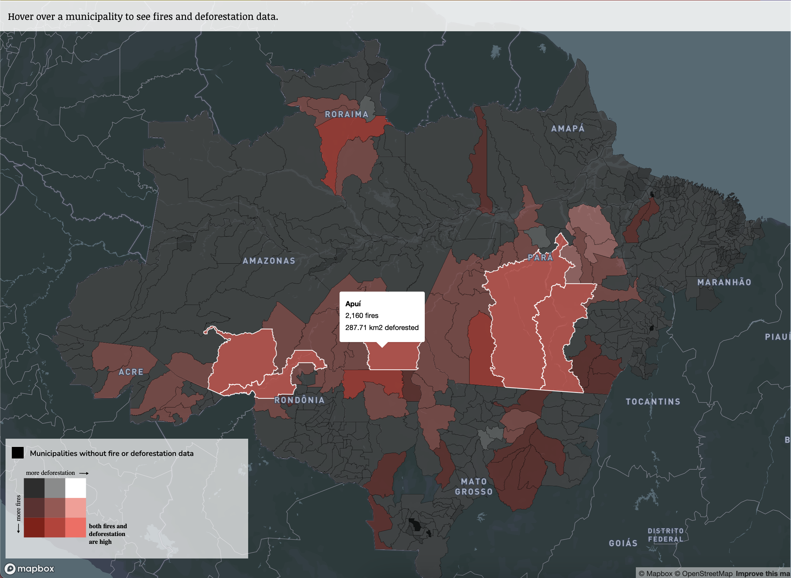
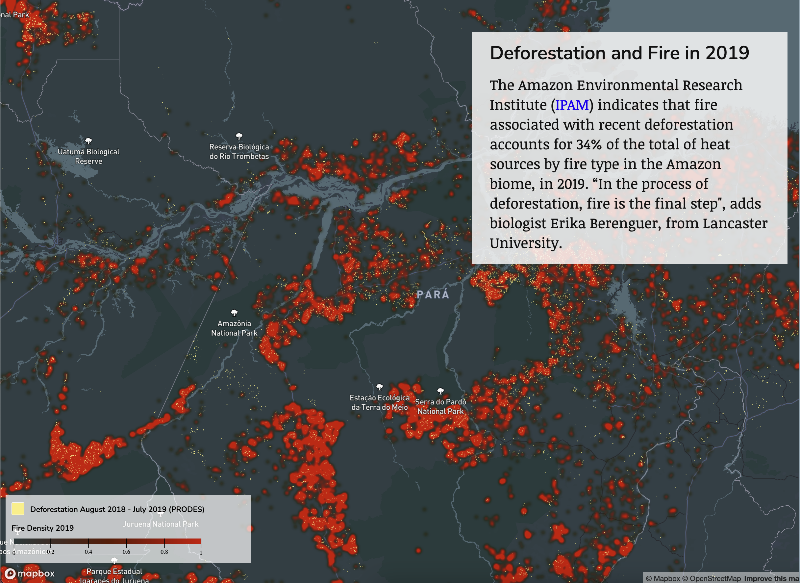

The Smoke Screen story came out at an interesting time – right after then-president of Brazil Bolsonaro claimed that there was no crisis of forest fires in the region, and that fires were mostly the work of small traditional farming communities and indigenous groups, we were able to show the large-scale connection between forest fires and deforestation on large industrial properties. 

The scrollytelling section with various maps dives into the data from 2019, when fires reached a historic high. After analyzing various datasets in QGIS, I put together the scrollytelling using Mapbox.gl and JavaScript.

