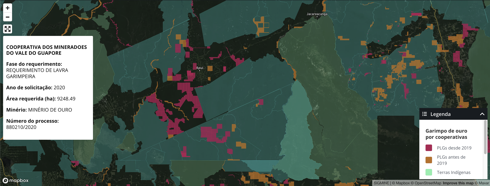

---
title: Gold Mining
story_link: https://infoamazonia.org/2021/10/22/cooperativa-garimpeira-maiores-mineradoras-amazonia/
subtitle: Mapping the effect of a fast-growing gold mining cooperative in the Brazilian Amazon
tools: Mapbox.GL, QGIS, Geo plugin for Wordpress
---

I worked with InfoAmazonia to publish an interactive map describing a particular crisis in the Brazilian Amazon. In many different regions of the Amazon, the reporters found an alarming expansion of gold mining bordering indigenous lands, encroaching on protected areas.

This rapid expansion was the work of one particular cooperative, called "Vale do Guaporé". The maps revealed the sheer scale and distance of the concessions given to this group. 

Here is a key quote from the story, from an attorney at the Federal Public Prosecutor's Office: "It's a way of pushing the limit. It is very absurd to grant areas in several places to a single cooperative, because it is impossible for the gold miners to be working in several places at the same time."

The tools I used for this map include QGIS, Mapbox.gl and the Geo plugin for Wordpress.

