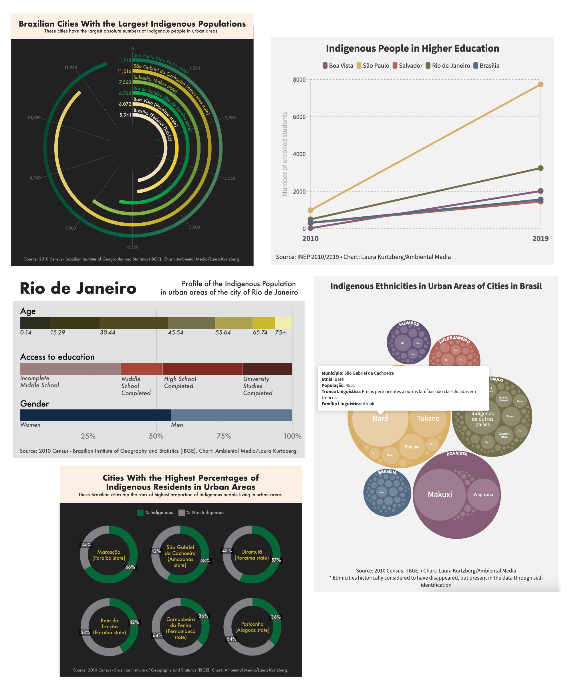

Mongabay published a special interactive multimedia series, starting with an article titled ‘We are made invisible’: Brazil’s Indigenous people on prejudice in major cities. I created interactive charts for all three parts of the series and additional related articles, sharing demographic information to help describe the makeup of indigenous communities in cities like São Paulo, Rio de Janeiro, and Salvador.

I used a few different tools to create these charts, including [Flourish](https://flourish.studio/), Adobe Illustrator, and R. 

